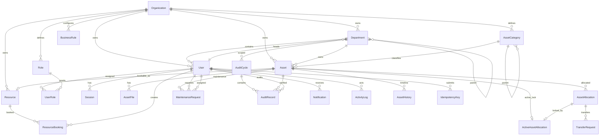

# AssetFlow Backend Architecture

## Existing Schema Review

The original schema was a useful first draft, but it modeled screens and CRUD records more than ERP workflows.

Main problems fixed:

- No tenant boundary. A commercial ERP needs an `Organization` boundary on operational data so uniqueness, authorization, reports, and future SaaS isolation are coherent.
- `Float` for money. Asset purchase cost must use `Decimal`; binary floating point is unacceptable for financial values.
- Destructive cascade deletes on assets, files, and allocations. ERP history must be retained. The redesigned schema uses `deletedAt` for soft delete and `Restrict` for history-bearing relations.
- One role per user. That blocks future permission expansion. `UserRole` allows RBAC to evolve without changing `User`.
- Resource booking pointed directly to `Asset`. Meeting rooms and shared resources are not always assets, so booking now targets `Resource`, with an optional `assetId`.
- No hard protection against double allocation. `ActiveAssetAllocation` is a database lock table with `assetId` as the primary key.
- No hard protection against overlapping bookings. This requires a PostgreSQL exclusion constraint in migration SQL because Prisma cannot express range exclusion constraints.
- No idempotency support. Retried POST requests can duplicate allocations, bookings, or approvals without `IdempotencyKey`.
- No sessions. JWT in HttpOnly cookies still needs server-side revocation and device/session tracking.
- No optimistic locking. Workflow entities now carry `version` where concurrent transitions can race.
- Audit and activity were too thin. `ActivityLog` and `AssetHistory` now capture actor, role, entity, previous state, new state, reason, metadata, and timestamp.
- Status enums were not aligned to the requested state machines. They now map to explicit workflow transitions.
- No configurable business rules. `BusinessRule` supports tenant-specific booking buffers, hold duration defaults, return windows, escalation thresholds, and similar policy.

## Core Design Decisions

`Organization` exists because this should evolve into SaaS. All operational records are scoped by organization. This makes indexes selective, prevents cross-tenant uniqueness collisions, and gives every API a consistent authorization boundary.

`Role` plus `UserRole` exists because ERP permissions change. Today a user may have one role, but tomorrow an asset manager may also be a department head. The join table avoids a schema migration for that.

`Department` is hierarchical because real organizations are hierarchical. The parent relation supports roll-up reporting for department usage, allocations, and audits.

`AssetCategory` is hierarchical because depreciation rules, warranty defaults, and reports often need category trees, not flat tags.

`Asset` is the inventory source of truth. It stores immutable identifiers (`assetTag`, `serialNumber`), lifecycle state, condition, ownership department, and optimistic `version`.

`Resource` separates bookable capacity from physical inventory. A meeting room can be booked but is not an asset; a laptop can be both an asset and a resource through the optional unique `assetId`.

`AssetAllocation` is the historical allocation ledger. `ActiveAssetAllocation` is the concurrency guard. Creating both in one transaction makes two active allocations for one asset impossible.

`ResourceBooking` stores times as `DateTime` in UTC plus the resource timezone for display and policy. Clients send intended local time and timezone, but the server converts and validates.

`MaintenanceRequest`, `TransferRequest`, and `AuditCycle` are workflow aggregates. They carry `version` to prevent double approvals and illegal concurrent state transitions.

`ActivityLog` is the cross-module audit trail. `AssetHistory` is asset-specific timeline materialized for fast asset detail pages.

`IdempotencyKey` exists for every mutating workflow endpoint. Retries should return the original response, not repeat side effects.

## ER Diagram



## PostgreSQL Migration Constraints

Prisma cannot express all production constraints. Add these in the first manual migration after `prisma migrate dev --create-only`.

```sql
CREATE EXTENSION IF NOT EXISTS btree_gist;

ALTER TABLE "ResourceBooking"
  ADD CONSTRAINT resource_booking_time_order
  CHECK ("endAt" > "startAt");

ALTER TABLE "ResourceBooking"
  ADD CONSTRAINT resource_booking_no_overlap
  EXCLUDE USING gist (
    "resourceId" WITH =,
    tstzrange("startAt", "endAt", '[)') WITH &&
  )
  WHERE ("status" IN ('HELD', 'CONFIRMED', 'CHECKED_IN'));

ALTER TABLE "AssetAllocation"
  ADD CONSTRAINT allocation_return_after_allocate
  CHECK ("returnedAt" IS NULL OR "returnedAt" >= "allocatedAt");

ALTER TABLE "AuditCycle"
  ADD CONSTRAINT audit_cycle_time_order
  CHECK ("plannedEndAt" > "plannedStartAt");

CREATE OR REPLACE FUNCTION prevent_closed_audit_record_update()
RETURNS trigger AS $$
BEGIN
  IF EXISTS (
    SELECT 1 FROM "AuditCycle"
    WHERE id = OLD."auditCycleId" AND status = 'CLOSED'
  ) THEN
    RAISE EXCEPTION 'Audit records are immutable after audit cycle closes';
  END IF;
  RETURN NEW;
END;
$$ LANGUAGE plpgsql;

CREATE TRIGGER audit_record_immutable_when_closed
BEFORE UPDATE OR DELETE ON "AuditRecord"
FOR EACH ROW EXECUTE FUNCTION prevent_closed_audit_record_update();
```

State transitions should also be enforced in the service layer and backed by narrow SQL updates such as `WHERE id = $id AND status = 'PENDING' AND version = $version`.

## Backend Folder Structure

```text
src/
  app/
    api/
      auth/login/route.ts
      auth/signup/route.ts
      auth/logout/route.ts
      dashboard/route.ts
      assets/route.ts
      assets/[id]/route.ts
      assets/[id]/timeline/route.ts
      allocations/route.ts
      allocations/[id]/return/route.ts
      transfers/route.ts
      transfers/[id]/approve/route.ts
      bookings/route.ts
      resources/[id]/availability/route.ts
      maintenance/route.ts
      maintenance/[id]/approve/route.ts
      maintenance/[id]/assign/route.ts
      maintenance/[id]/resolve/route.ts
      audits/route.ts
      audits/[id]/close/route.ts
      notifications/route.ts
  server/
    db/prisma.ts
    auth/jwt.ts
    auth/session.ts
    auth/password.ts
    auth/rbac.ts
    http/errors.ts
    http/response.ts
    http/idempotency.ts
    modules/
      assets/
        asset.repository.ts
        asset.service.ts
        asset.schemas.ts
        asset.state.ts
      allocations/
        allocation.repository.ts
        allocation.service.ts
        allocation.schemas.ts
      bookings/
        booking.repository.ts
        booking.service.ts
        availability.service.ts
        booking.schemas.ts
      maintenance/
        maintenance.repository.ts
        maintenance.service.ts
        maintenance.state.ts
      audits/
        audit.repository.ts
        audit.service.ts
        audit.state.ts
      organization/
        department.service.ts
        user.service.ts
      notifications/
        notification.service.ts
      activity/
        activity.service.ts
    shared/
      transactions.ts
      clock.ts
      pagination.ts
      validators.ts
      constants.ts
```

## API Architecture

All mutating endpoints use:

- JWT session from HttpOnly cookie.
- Organization scope from authenticated session.
- RBAC check before service execution.
- Zod validation at the route boundary.
- Idempotency key for POST workflow commands.
- Server timestamp only.
- Transaction around state change, history, activity log, and notification.

Primary commands:

- `POST /api/auth/signup`: creates user with `EMPLOYEE` role only.
- `POST /api/auth/login`: creates session and sets cookie.
- `GET /api/dashboard`: aggregates KPIs by organization and role scope.
- `GET /api/assets`: paginated search/filter.
- `POST /api/assets`: create asset, optional resource, files.
- `PATCH /api/assets/:id`: optimistic update by `version`.
- `POST /api/allocations`: transactionally create allocation and `ActiveAssetAllocation`.
- `POST /api/allocations/:id/return`: remove active lock, mark returned, set asset available.
- `POST /api/bookings`: create hold or confirmed booking; DB exclusion constraint prevents overlaps.
- `GET /api/resources/:id/availability`: computes availability from confirmed/held bookings and resource buffers.
- `POST /api/maintenance`: raise request and optionally move asset into maintenance after approval.
- `POST /api/maintenance/:id/approve`: status transition `PENDING -> APPROVED`.
- `POST /api/maintenance/:id/assign`: status transition `APPROVED -> ASSIGNED`.
- `POST /api/maintenance/:id/resolve`: status transition `IN_REPAIR -> RESOLVED`, update asset condition/status.
- `POST /api/audits`: create cycle and planned records.
- `POST /api/audits/:id/close`: freeze records using DB trigger.
- `GET /api/notifications`: unread and historical notifications.

## Migration Plan

1. Replace the current draft schema with `prisma/schema.prisma`.
2. Run `npx prisma format && npx prisma validate`.
3. Create the first migration with `npx prisma migrate dev --name init_assetflow_erp --create-only`.
4. Edit the generated SQL to add the PostgreSQL constraints listed above.
5. Apply with `npx prisma migrate dev`.
6. Seed one organization, four roles, an admin user, default business rules, and base categories.
7. Add service-layer state transition tests before building UI flows.

## Implementation Roadmap

1. Foundation: Prisma client, error handling, Zod route validation, JWT cookie sessions, RBAC middleware.
2. Organization and auth: signup, login, seed roles, admin role assignment endpoint.
3. Asset master data: departments, categories, assets, files, soft delete, asset timeline.
4. Allocation workflow: atomic allocation, return, transfer request, approval, activity logging.
5. Booking workflow: resources, availability API, hold expiration, exclusion constraint handling.
6. Maintenance workflow: approval, assignment, repair, resolution, asset state synchronization.
7. Audit workflow: cycle creation, auditor assignment, immutable closed records, report generation.
8. Dashboard and reports: KPIs, utilization, idle assets, maintenance frequency, department usage.
9. Notifications: workflow events, unread counts, read state.
10. Hardening: integration tests for concurrency, idempotency, RBAC, illegal transitions, and migration constraints.
